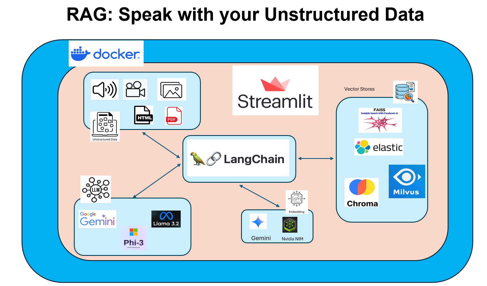
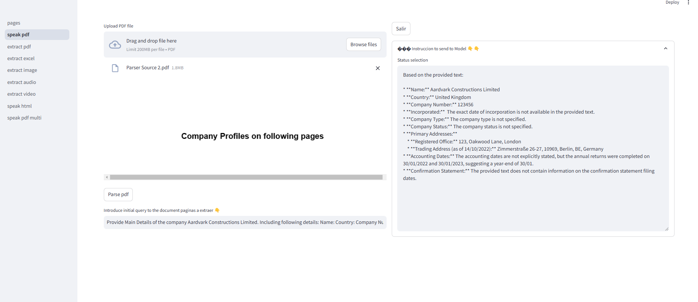
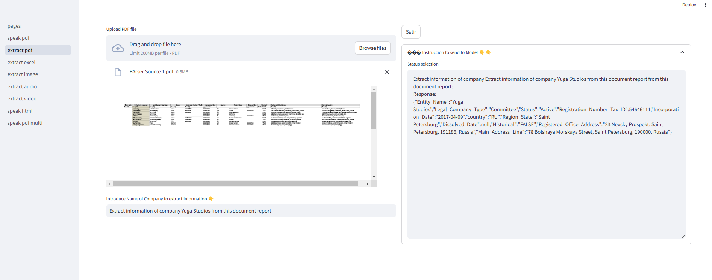
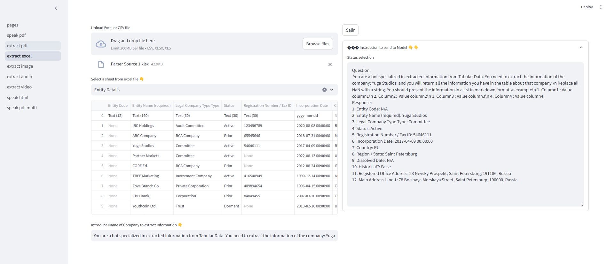
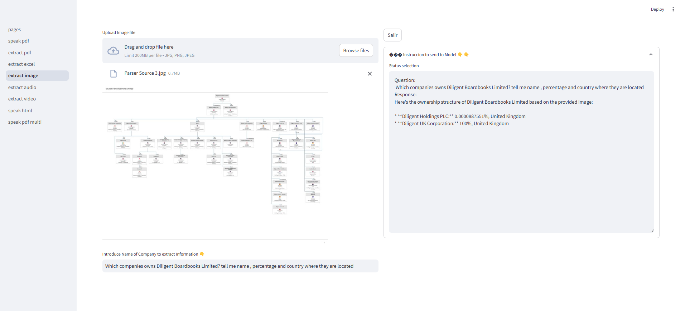
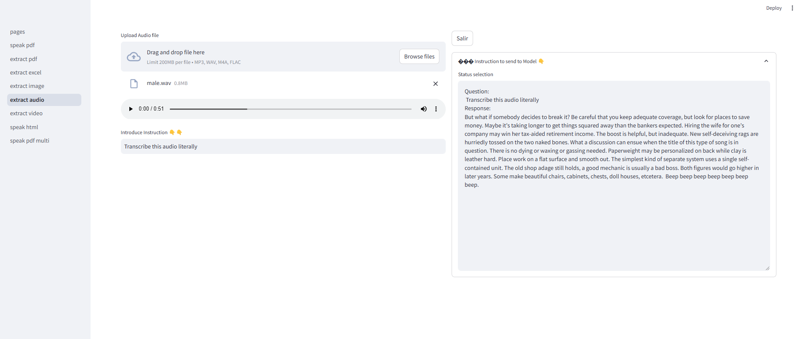
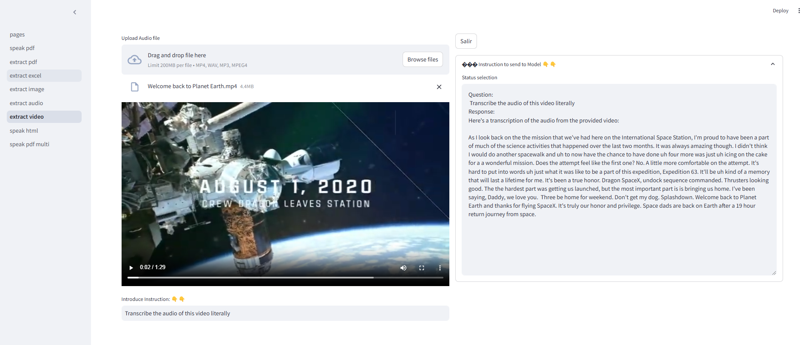
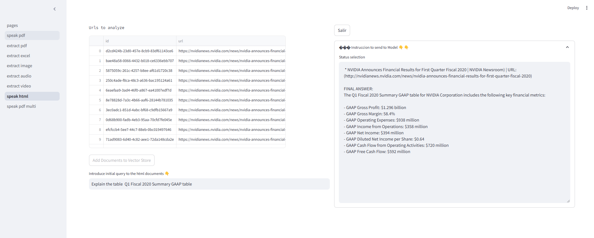
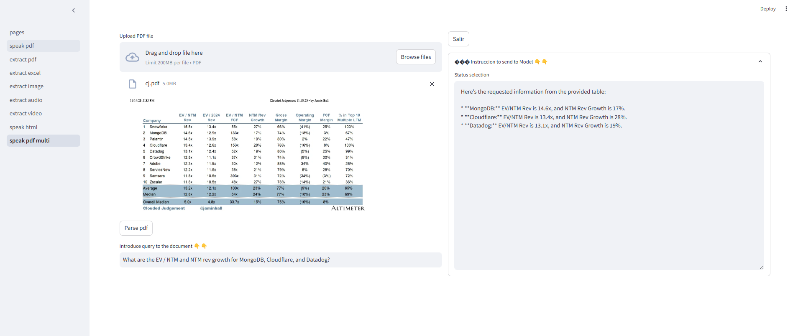

# RAG: Speak with your Unstructured Data

# Introduction 
This repo constains an E2E Rag application which showcases diferent use and Integrations of Langchain with other technologies to "chat" with your Unstructured Data (audio, video, images, pdf, excel, csv and html).

The main technology we will use will be Langchain, as LLMs we will use Gemini Pro Fast, Microsoft Phi3.5 Mini and LLama 3.2 3B, the last two hosted on Nvidia NIM. 

VectorStores Elastic, Choma, Faiss and Vilmus. 

Embeddings Models: Gemini and Nvidia embeddings

As a UX tool and application server we will use Streamlit

Docker and Docker compose to create containers

# High Level Description of Functionalities

### Speak with your pdfs
Here we load a large pdf and extract text with langchain Dataloaders. Then create embeddings with Gemini embedding models (Ex. models/embedding-001) and add them to Elastic or Faiss vector Stores using their Integration with langchain. Finally we can query/chat with the document using an LLM ,default gemini-1.5-flash-002, but you can use any multimodal LLM in Gemini API.

### Extract pdfs
Here we load a pdf and extract information based in a Data model created with Pydantic. we are using the integration of Langchain with that library and simply use a multi-modal LLM and a prompt in Natural language to find all the information related to a company in this case. The information obtained from the llm then it is parsed and sanitized using the pydantic clase. See EntityDataExtraction class [here](src/data_models.py). As LLM ,default gemini-1.5-flash-002, but you can use any text LLM in Gemini API.

### Extract excel
Here we use the integration of Langchain with Pandas Library to manipulate excel or csv files. We send an information to extract data from a file and then the LLM will generate python code using pandas to get what it is requested. The code it is executed internally in lanchain/pandas class and the output it is returned to the LLM to evaluate if it has all the need it information or need refinement and create more pandas code. One the LLM consider it has all the information to build an answer, this is returned to the user. As LLM ,default gemini-1.5-flash-002, but you can use any text LLM in Gemini API. Example [here](docs/excel.md)

### Extract Image
Here we load an Image to a multimodal model and send a prompt asking for some information. We can use as well a similar approach that we did on extract from pdf using a pydantic data model. As LLM,default gemini-1.5-flash-002, but you can use any multimodal LLM in Gemini API.

### Extract Audio
Here we load an audio to a multimodal model and send a prompt asking for some information. We can use as well a similar approach that we did on extract from pdf using a pydantic data model. As LLM,default gemini-1.5-flash-002, but you can use any multimodal LLM in Gemini API.

### Extract Video
Here we load an video to a multimodal model and send a prompt asking for some information. We can use as well a similar approach that we did on extract from pdf using a pydantic data model. As LLM,default gemini-1.5-flash-002, but you can use any multimodal LLM in Gemini API.

### Extract html
Here we load a number of html web pages and extract text and tables using BeautifulSoup. Here we use the infrastructure of NVIDIA NIM and its SDK to call models for embeddings and generate text:
- NVIDIA_EMBEDDINGS=NV-Embed-QA
- NVIDIA_MODEL=microsoft/phi-3-small-128k-instruct (here we can use as well LLama3.2 3b Instruct or any other llm text able).

To split the text in this case we use the following model
TEXT_SPLITTER_MODEL=intfloat/e5-large-v2

As vector store we use Milvus or Elastic

### Speak pdf multi
Here we use a tool like pymupdf or pymupdf4llm to extract text images and tables from a pdf. One we have these elements, we use a Multimodal LLM, in this case gemini-1.5-flash-002, to create descriptive summaries of them. Then we use a embeddings model to to create embeddings of those summaries. 
One we have the embeddings we create id,s for all those summaries and embeddings and we upload them to a vector store (Chroma in this case) with metadata related to the document and page where the origen of the summary it is located. Last step we upload in binary format(images here) or the original text to any specific summary to the Chroma DocStore and link embedding, summary and original source using the id. 

When we query or ask the model, we will create an embedding of the query , get the top 5 more relevant vectors similar to the query and using the ID,s of those documents, Chroma will return the binary data source of those ID,s. 

Then the LLM will produce an anwer using the binary data (images or other unstructured format), original text returned from the docStore and the query introduced by the user

# Getting Started
TODO: Guide users through getting your code up and running on their own system. In this section you can talk about:
1.	Installation process
2.	Software dependencies
3.	Latest releases
4.	API references

# Build and Test
TODO: Describe and show how to build your code and run the tests. 

# Contribute
TODO: Explain how other users and developers can contribute to make your code better. 

If you want to learn more about creating good readme files then refer the following [guidelines](https://docs.microsoft.com/en-us/azure/devops/repos/git/create-a-readme?view=azure-devops). You can also seek inspiration from the below readme files:
- [ASP.NET Core](https://github.com/aspnet/Home)
- [Visual Studio Code](https://github.com/Microsoft/vscode)
- [Chakra Core](https://github.com/Microsoft/ChakraCore)